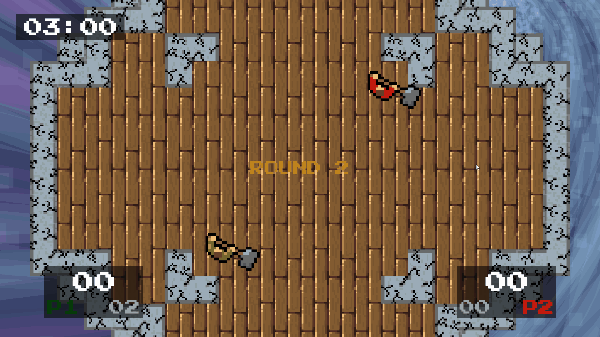

# 🎮 Cyclone Eye — Level Up 2020 🏆

## 🧠 Présentation

Un jeu de survie dynamique dans lequel vous incarnez un astronaute tentant de réparer son vaisseau spatial, endommagé après avoir traversé les dangers de l’espace.

Le joueur doit identifier rapidement les pannes, intervenir efficacement et gérer une pression croissante à mesure que de nouveaux problèmes apparaissent.

L’objectif est de survivre le plus longtemps possible.

Ce projet a été développé en 48 heures dans le cadre de la Level Up 2020.

🏆 **Le jeu a remporté le 1er prix de la game jam.**

---

## 🎥 Aperçu

> Exemple de gameplay : gestion des pannes en temps réel sous pression

---

## 🎮 Gameplay

Le joueur évolue dans un vaisseau en panne et doit :

- réparer différents systèmes critiques  
- réagir rapidement à l’apparition de nouvelles pannes  
- maintenir le vaisseau opérationnel le plus longtemps possible  

Le gameplay repose sur la gestion du stress, la rapidité d’exécution et la priorisation des actions.

---

## 🧑‍🤝‍🧑 Équipe

Projet réalisé en équipe dans le cadre de la game jam.

*(ajoute les noms si possible)*

---

## 🛠️ Technologies

- Unity (C#)

---

## 🧠 Mon rôle

*(à compléter — très important)*

Exemple :

- Gameplay programming  
- Implémentation des systèmes de réparation  
- Contribution à la boucle de gameplay  

---

## ⚡ Contexte Game Jam

Ce projet a été développé en 48 heures, ce qui implique :

- prise de décision rapide  
- priorisation des fonctionnalités  
- collaboration efficace en équipe  

---

## 📖 Plus de détails

👉 Article complet sur le projet :  
https://www.dylanvonarx.ch/posts/get-out-game/

---

## 📌 Ce que j’ai appris

- développer un jeu complet en temps limité  
- travailler efficacement en équipe  
- concevoir une boucle de gameplay claire rapidement  
- itérer sous contrainte  

---

## 💬 Note

Ce projet est un prototype réalisé dans un contexte de game jam.  
Il met en avant la capacité à concevoir et implémenter un gameplay fonctionnel en très peu de temps.
